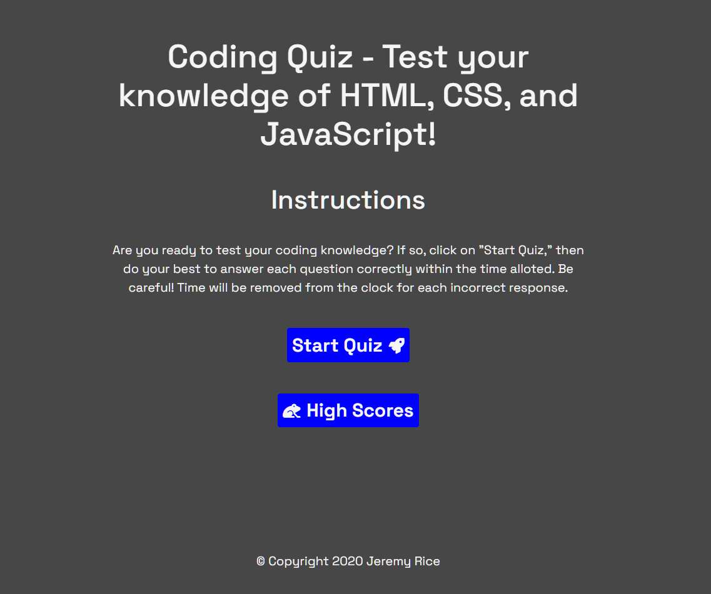

## Coding Quiz

## Description 

This website is a timed coding quiz with multiple-choice questions. It runs in the browser, and features dynamically updated HTML and CSS powered by JavaScript. 

This website does not fulfill all of the acceptance criteria for this assignment. It does not address:
WHEN I answer a question incorrectly
THEN time is subtracted from the clock

[Link to published website](https://jdavidrice.github.io/Coding_Quiz/)

## Table of Contents

* [Description](#Description)
* [Table of Contents](#Table-of-Contents)
* [Photo](#Photo)
* [Installation](#Installation)
* [Usage](#Usage)
* [Credits](#Credits)
* [License](#License)
* [Badges](#Badges)
* [Contributing](#Contributing)
* [Tests](#Tests)

## Photo

* [Return to Top](#Coding-Quiz)

## Installation

There is nothing to install to access the information on this website. 

* [Return to Top](#Coding-Quiz)

## Usage 

Use this short coding quiz to test your knowledge of HTML, CSS, and JavaScript.

* [Return to Top](#Coding-Quiz)

## Credits

Credit to Brian Design for his video [How to Make a Quiz App...](https://www.youtube.com/watch?v=f4fB9Xg2JEY&t=2s)

Credit to Mateusz Rybczonek for his article [How to Create an Animated Countdown Timer...](https://css-tricks.com/how-to-create-an-animated-countdown-timer-with-html-css-and-javascript/)

* [Return to Top](#Coding-Quiz)

## License

No licenses used or implied 

* [Return to Top](#Coding-Quiz)

## Badges

No badges 

* [Return to Top](#Coding-Quiz)

## Contributing

Jeremy Rice

* [Return to Top](#Coding-Quiz)

## Tests

No tests

* [Return to Top](#Coding-Quiz)